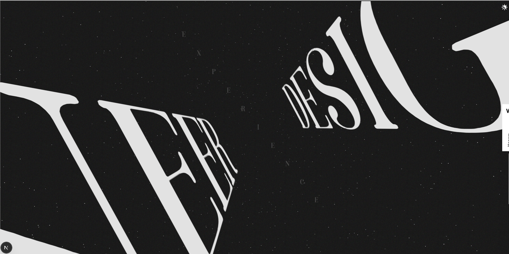
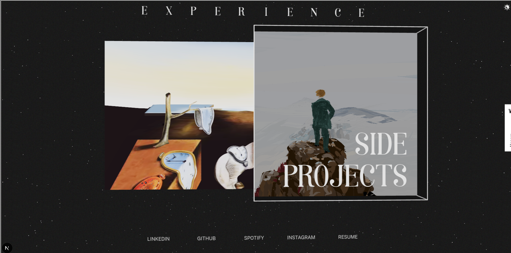
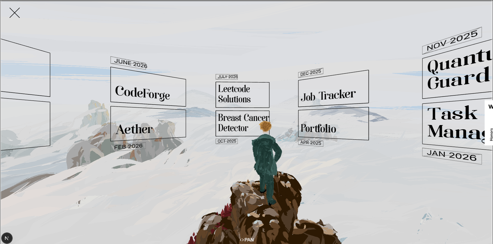
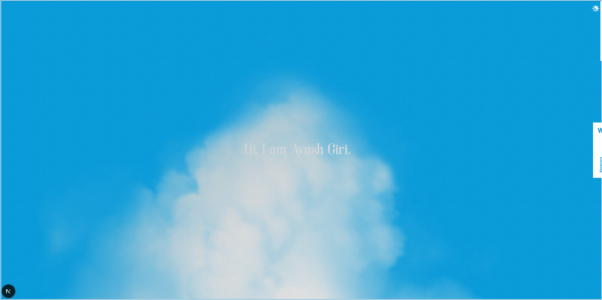

# ayusxt25.github.io
Hello there! I'm Ayush Giri, frontend engineer by profession, a creative at heart.

This is the updated version of my personal website which is now in 3D. LFG!

> Note: this repository is also used as a template. If you want to deploy your own custom domain, set `GH_PAGES_CUSTOM_DOMAIN` in the workflow and the build will generate `public/CNAME` automatically. Use `NEXT_PUBLIC_GA_ID` to enable Google Analytics tracking. Otherwise, leave the custom domain env unset and the repo will continue to work as a GitHub Pages site.

## Live Project

- Portfolio: https://ayush-portfolio-tawny-six.vercel.app/

## Tech Stack

- Next.js
- React
- React-three-fiber
- DREI
- GSAP
- Zustand
- Tailwind

## Screenshots

### Theme

---

### Scroll

---

### Experience

---

### Projects

---

### SKy

